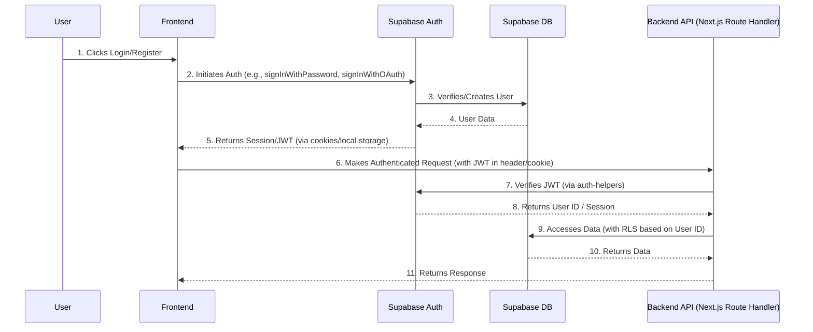

# Backend Architecture

## Service Architecture

### Function Organization

```text
apps/web/
├── src/
│   ├── app/
│   │   ├── api/
│   │   │   ├── auth/
│   │   │   │   ├── login/
│   │   │   │   │   └── route.ts
│   │   │   │   └── register/
│   │   │   │       └── route.ts
│   │   │   ├── games/
│   │   │   │   ├── route.ts      # For /api/games (list all games)
│   │   │   │   └── [gameId]/
│   │   │   │       ├── route.ts  # For /api/games/[gameId] (get game details)
│   │   │   │       └── complete/
│   │   │   │           └── route.ts # For /api/games/[gameId]/complete
│   │   │   ├── nfts/
│   │   │   │   ├── route.ts      # For /api/nfts (list user's NFTs)
│   │   │   │   └── [nftId]/
│   │   │   │       ├── route.ts  # For /api/nfts/[nftId] (get NFT details)
│   │   │   │       └── feature/
│   │   │   │           └── route.ts # For /api/nfts/[nftId]/feature
│   │   │   └── lottery/
│   │   │       └── draws/
│   │   │           ├── route.ts  # For /api/lottery/draws (list draws)
│   │   │           └── [drawId]/
│   │   │               └── route.ts # For /api/lottery/draws/[drawId]
│   ├── lib/
│   │   ├── repositories/
│   │   └── supabase/
│   ├── services/             # Backend business logic services (e.g., authService, gameService)
│   └── types/                # Backend-specific types (if any, prefer shared)
```

### Function Template

```typescript
// apps/web/src/app/api/auth/login/route.ts
import { NextResponse } from 'next/server';
import { createRouteHandlerClient } from '@supabase/auth-helpers-nextjs';
import { cookies } from 'next/headers';
import { authService } from '@/lib/services/authService'; // Backend business logic service

export async function POST(request: Request) {
  const { email, password } = await request.json();
  const supabase = createRouteHandlerClient({ cookies });

  try {
    const { session, user, error } = await authService.login(supabase, email, password); // Call backend service
    if (error) {
      return NextResponse.json({ error: error.message }, { status: 401 });
    }

    // Set session cookie via Supabase auth-helpers
    // The createRouteHandlerClient handles setting the session cookie automatically on successful auth

    return NextResponse.json({ user, token: session?.access_token });
  } catch (error: any) {
    console.error('Login error:', error);
    return NextResponse.json({ error: error.message || 'Internal Server Error' }, { status: 500 });
  }
}
```

## Database Architecture

### Schema Design

The database schema is defined in the "Database Schema" section above, using PostgreSQL.

### Data Access Layer

```typescript
// lib/repositories/userRepository.ts
import { SupabaseClient } from '@supabase/supabase-js';
import { User } from '@/packages/shared/types'; // Assuming shared types

export class UserRepository {
  private supabase: SupabaseClient;

  constructor(supabase: SupabaseClient) {
    this.supabase = supabase;
  }

  async findById(id: string): Promise<User | null> {
    const { data, error } = await this.supabase
      .from('users')
      .select('*')
      .eq('id', id)
      .single();

    if (error && error.code !== 'PGRST116') { // PGRST116 is "no rows found"
      throw new Error(`Failed to find user by ID: ${error.message}`);
    }
    return data as User | null;
  }

  async create(user: Omit<User, 'id' | 'createdAt' | 'updatedAt'>): Promise<User> {
    const { data, error } = await this.supabase
      .from('users')
      .insert(user)
      .select()
      .single();

    if (error) {
      throw new Error(`Failed to create user: ${error.message}`);
    }
    return data as User;
  }

  // ... other CRUD operations for User
}
```

## Authentication and Authorization

### Auth Flow



### Middleware/Guards

```typescript
// lib/middleware/authMiddleware.ts (Example for an API Route)
import { NextRequest, NextResponse } from 'next/server';
import { createRouteHandlerClient } from '@supabase/auth-helpers-nextjs';
import { cookies } from 'next/headers';

export async function requireAuth(request: NextRequest, handler: Function) {
  const supabase = createRouteHandlerClient({ cookies });
  const { data: { session } } = await supabase.auth.getSession();

  if (!session) {
    return NextResponse.json({ error: 'Unauthorized' }, { status: 401 });
  }

  // Attach user ID to request for downstream services
  (request as any).userId = session.user.id;

  return handler(request);
}

// Example usage in an API Route:
// export async function GET(request: NextRequest) {
//   return requireAuth(request, async (req: NextRequest) => {
//     const userId = (req as any).userId;
//     // ... business logic using userId
//     return NextResponse.json({ message: `Hello, user ${userId}` });
//   });
// }
```
