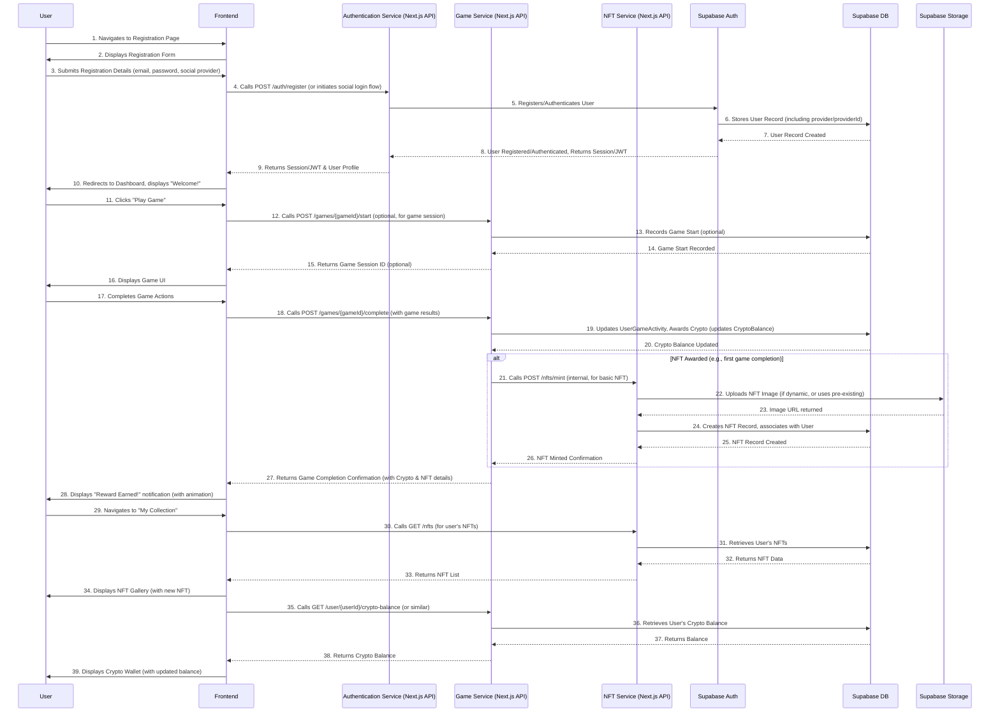

# Core Workflows

## Core Workflow: Register, Play Game, Earn Crypto & NFT

```mermaid
sequenceDiagram
    participant User
    participant Frontend
    participant Auth_Service as Authentication Service (Next.js API)
    participant Game_Service as Game Service (Next.js API)
    participant NFT_Service as NFT Service (Next.js API)
    participant Supabase_Auth as Supabase Auth
    participant Supabase_DB as Supabase DB
    participant Supabase_Storage as Supabase Storage

    User->>Frontend: 1. Navigates to Registration Page
    Frontend->>User: 2. Displays Registration Form

    User->>Frontend: 3. Submits Registration Details (email, password, social provider)
    Frontend->>Auth_Service: 4. Calls POST /auth/register (or initiates social login flow)
    Auth_Service->>Supabase_Auth: 5. Registers/Authenticates User
    Supabase_Auth->>Supabase_DB: 6. Stores User Record (including provider/providerId)
    Supabase_DB-->>Supabase_Auth: 7. User Record Created
    Supabase_Auth-->>Auth_Service: 8. User Registered/Authenticated, Returns Session/JWT
    Auth_Service-->>Frontend: 9. Returns Session/JWT & User Profile
    Frontend->>User: 10. Redirects to Dashboard, displays "Welcome!"

    User->>Frontend: 11. Clicks "Play Game"
    Frontend->>Game_Service: 12. Calls POST /games/{gameId}/start (optional, for game session)
    Game_Service->>Supabase_DB: 13. Records Game Start (optional)
    Supabase_DB-->>Game_Service: 14. Game Start Recorded
    Game_Service-->>Frontend: 15. Returns Game Session ID (optional)
    Frontend->>User: 16. Displays Game UI

    User->>Frontend: 17. Completes Game Actions
    Frontend->>Game_Service: 18. Calls POST /games/{gameId}/complete (with game results)
    Game_Service->>Supabase_DB: 19. Updates UserGameActivity, Awards Crypto (updates CryptoBalance)
    Supabase_DB-->>Game_Service: 20. Crypto Balance Updated

    alt NFT Awarded (e.g., first game completion)
        Game_Service->>NFT_Service: 21. Calls POST /nfts/mint (internal, for basic NFT)
        NFT_Service->>Supabase_Storage: 22. Uploads NFT Image (if dynamic, or uses pre-existing)
        Supabase_Storage-->>NFT_Service: 23. Image URL returned
        NFT_Service->>Supabase_DB: 24. Creates NFT Record, associates with User
        Supabase_DB-->>NFT_Service: 25. NFT Record Created
        NFT_Service-->>Game_Service: 26. NFT Minted Confirmation
    end

    Game_Service-->>Frontend: 27. Returns Game Completion Confirmation (with Crypto & NFT details)
    Frontend->>User: 28. Displays "Reward Earned!" notification (with animation)

    User->>Frontend: 29. Navigates to "My Collection"
    Frontend->>NFT_Service: 30. Calls GET /nfts (for user's NFTs)
    NFT_Service->>Supabase_DB: 31. Retrieves User's NFTs
    Supabase_DB-->>NFT_Service: 32. Returns NFT Data
    NFT_Service-->>Frontend: 33. Returns NFT List
    Frontend->>User: 34. Displays NFT Gallery (with new NFT)

    Frontend->>Game_Service: 35. Calls GET /user/{userId}/crypto-balance (or similar)
    Game_Service->>Supabase_DB: 36. Retrieves User's Crypto Balance
    Supabase_DB-->>Game_Service: 37. Returns Balance
    Game_Service-->>Frontend: 38. Returns Crypto Balance
    Frontend->>User: 39. Displays Crypto Wallet (with updated balance)
```
